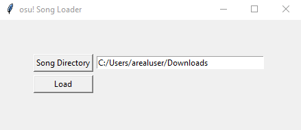

# osu! Song Loader
Load multiple osu! .osz songs from a directory.

## Table of Contents
* [Getting Started](#getting-started)
* [Prerequisites](#prerequisites)
* [Running the Application Locally](#running-the-application-locally)
* [Usage](#usage)

## Getting Started
Once the program is run you are greeted with a simple GUI interface. As long as you know what directory downloaded .osz are stored in,
you are good to go.

### Prerequisites
* [Python](https://www.python.org/downloads/)
* [osu!](https://osu.ppy.sh/home)

### Running the Application Locally
````
# Run the program.
python main.py
````

## Usage
This program is useful for loading osu! .osz from a directory automatically. By default, in order to load .osz into osu! you would need to
double-click song files to load them. With this program you can download all your favourite osu! beatmaps into one directory and then use the
simple GUI to load them all with a click of a button.


